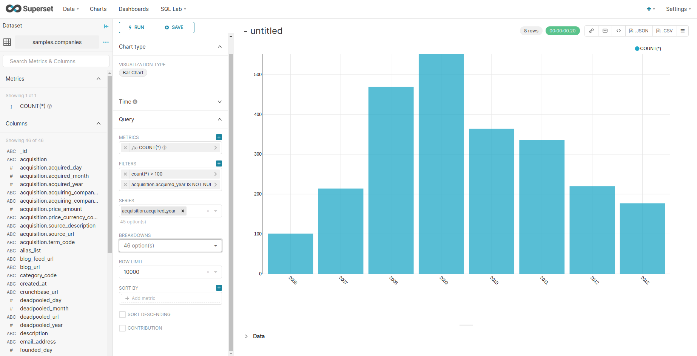

# Superset - 02 Create a simple bar chart

Next we can create our first chart using the `companies` dataset. This is :

* A Bar Chart
* With the metric `count(*)`
* 2 filters
    * `count(*) > 100`
    * `acquisition.acquired_year IS NOT NULL`
* 1 serie (to group by) `acquisition.acquired_year`

The bar chart is customized to `sort bars`

This is the first proof of concept of our POC. We are able to create charts using a collection in a mongodb database.
