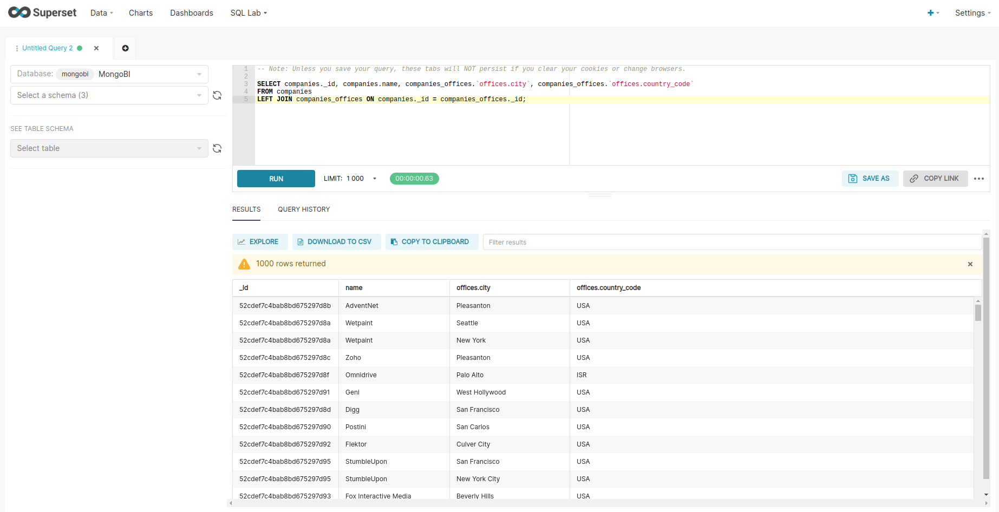
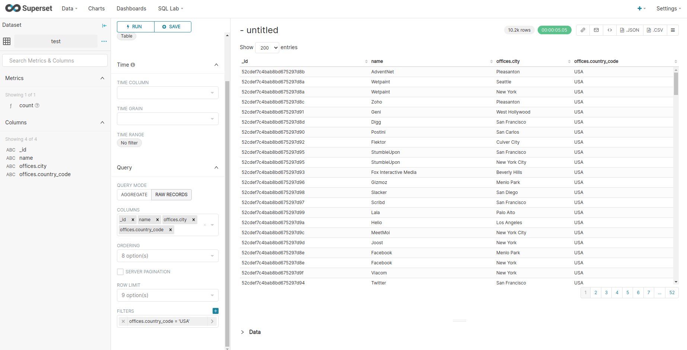

# Superset - 03 SQLlab and virtual table

Now let's start to create a chart based on a query built in the sql lab query editor. And to add a little bit more of a complexity, it will be a query with a join condition.

Open the `SQL Lab / SQL Editor` and type the following query then `RUN` :

```sql
SELECT companies._id, companies.name, companies_offices.`offices.city`, companies_offices.`offices.country_code`  
FROM companies 
LEFT JOIN companies_offices ON companies._id = companies_offices._id;
```



Look at the table extract where we have office in multiple countries.

Then click on `EXPLORE` and save this query as a new virtual table / virtual dataset named `test`


Create a new chart using this query :

* A table in query mode `RAW RECORDS`
* With all the columns selected
* and one filter `offices.country_code = 'USA`



The table is filtered to only show companies and their offices located in USA. This demonstrate that we can create virtual table in superset and manipulate them in the dashboard and chart editors.
