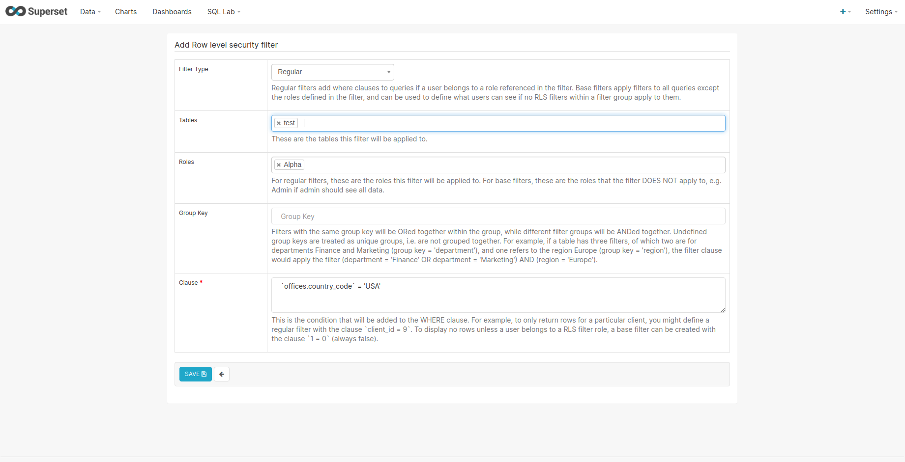
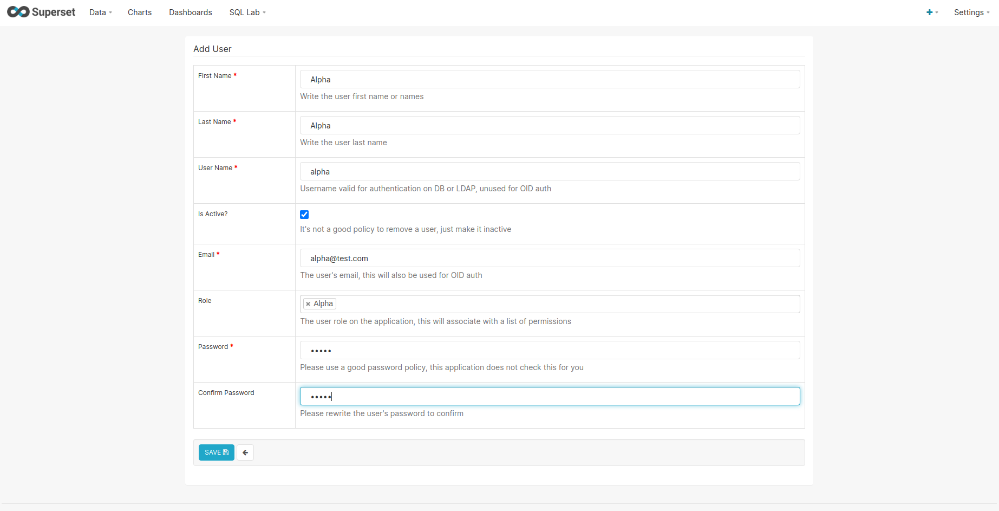

# Superset - 04 Row level security

This example uses the virtual table `test` created in [03 - SQLlab and virtual table](./03_sqllab_virtual_table.md).

Click on `Settings` in the top right corner then `Row level security` and create a new policy.

* *Filter type* : `Regular`
* *Tables* : `test`
* *Roles* : `alpha`
* *Group key* : `<empty>`
* *Clause* : `` `offices.country_code` = 'USA' ``

Next go to user administration and create a new User with role `alpha` :

* *First Name* : `Alpha`
* *Last Name* : `Alpha`
* *User Name* : `alpha`
* *Is Active?* : `<checked>`
* *Email* : `alpha@test.com`
* *Role* : `Alpha`
* *Password* : `alpha`

Open a private browser and authenticate with the new `alpha` user. Then go to the dataset `test` and explore it.

In this screenshot, it uses a table chart in agreggate mode grouped by the `offices.country_code` field exposing the metric `count(*)` without any filter. As you can see, only results with the country_code `USA` are being returned so we can prove that row level security is working correctly. To resume, this is :

* A Table Chart
* In `AGREGGATE` query mode
* With the metric `count(*)`
* Group by `offices.country_code`

