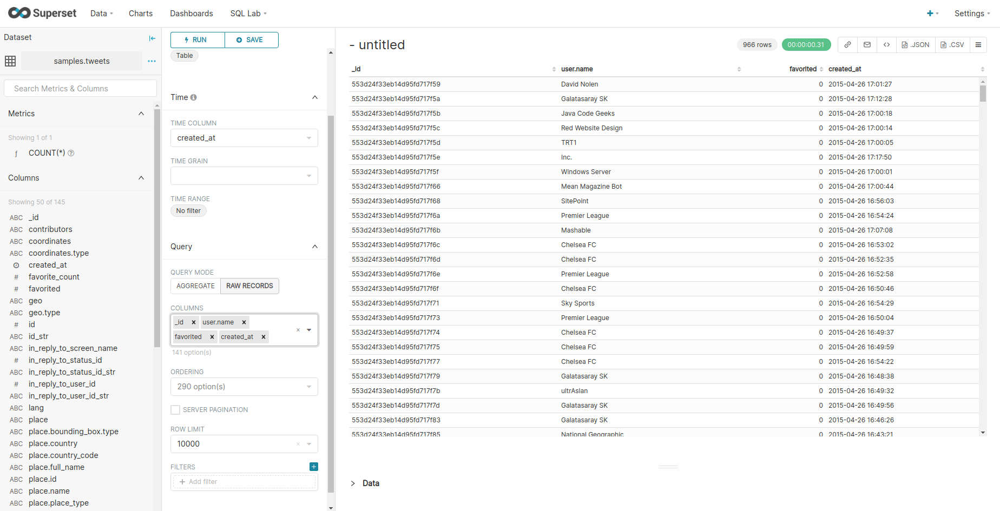
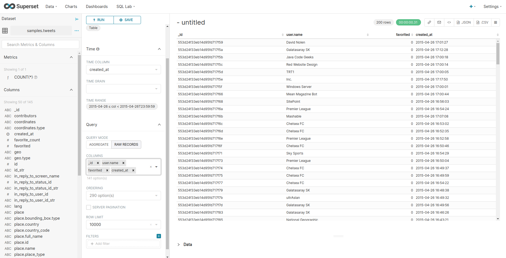

# Superset - 05 Table chart with time filter

Explore the dataset `tweets` created during [01 - Setup the database and datasets](./01_setup_database_datasets.md). We use a table chart with the following configuration :

* Time column `created_at`
* Time range `No filter`
* In `RAW RECORDS` query mode
* with the `_id`, `user.name`, `favorited` and `created_at` columns displayed

We can see that most of the tweets are around the date `2015-04-26` and there are 966 records being returned.

IN the time filter area, we change the date range type to `custom` with a `Specific Date/Time` of `2015-04-26 00:00:00` as start date and `2025-04-26 23:59:59` as end date.

We can now see that there are 200 records returned. We can conclude that time filters are working correctly.

*Note : the tweets dataset has a field named text. As we are using the auto discover schema of the mongo bi connector tool. It detects this field without renaming it. As text is a keyword in many SQL implementation, it can result in an error when querying it. We advise to define a custom definition for this field using the manual schema declaration feature of the mongo bi connector tool.*